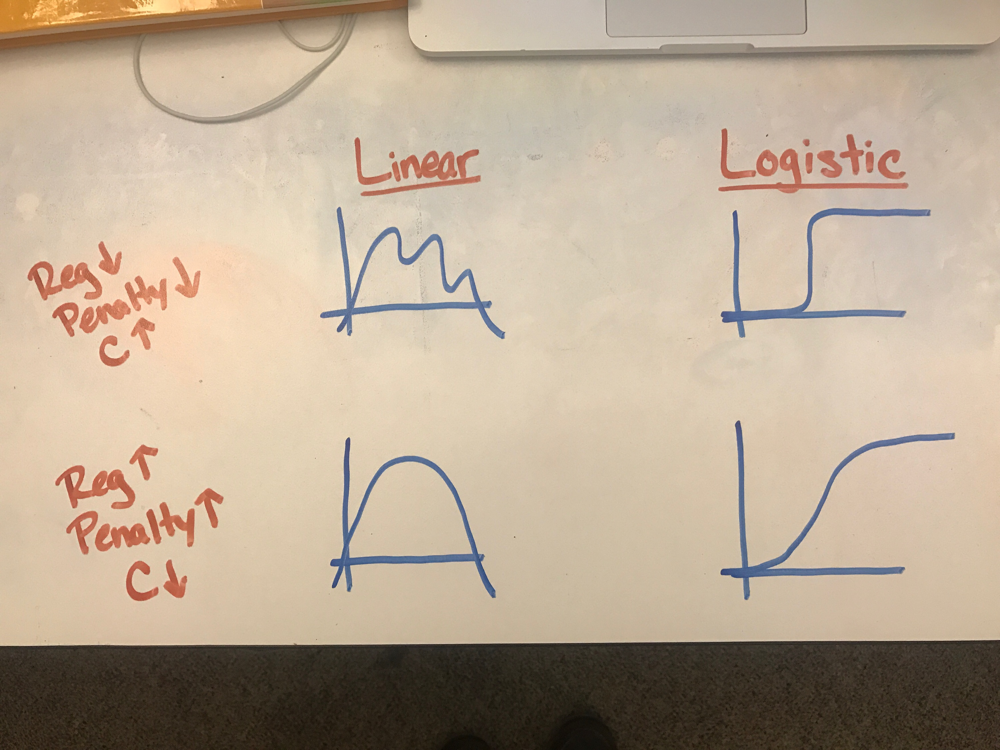

#  Advanced Model Evaluation
Week 4 | Lesson 4.07

### LEARNING OBJECTIVES
*After this lesson, you will be able to:*
- Learn about and use sklearn functions to help perform different kinds of model evaluation
- Demonstrate how to use sklearn GridSearch to autotune models
- Visualize gridsearch function
- Emphasize inverse relation between 'C' and penalty

---
## Introduction to Gridsearch

A correlation matrix is used to investigate the dependence between multiple variables at the same time. The result is a table containing the correlation coefficients between each variable and the others. This is ideal for feature selection when deciding which features to use in a predictive model.		 

NumPy has an easy to use method perform to perform matrix correlations called ‘corrcoef’. [Review the code](./code/4.06-breast-cancer-coefficients.ipynb) for performing a Pearson correlation coefficient matrix on the Breast Cancer Dataset.

In any linear model with multiple independent variables, you will want these independent variables to be roughly independent of each other _or_ you'll want to include an interaction term.

## What is "Gridsearch?"

**Check:** What is cross-validation, and why is it relevant to model-building?

**Check:** What is a loss function, and why is it relevant to model-building?

**Check:** What is a tuning parameter? Can you provide an example within the context of regularization?

Gridsearch combines these ideas together. Gridsearch is the process of searching for the optimal set of tuning parameters for a model. (Be careful: how can we define optimal?)

It searches across values of parameters and uses cross-validation to evaluate the effect. It's called gridsearch because one can visualize a "grid" of parameters that are iteratively searched.

## Demo: Gridsearch

For regularization like Ridge or LASSO, the optimal tuning parameters cannot be formulated automatically. We iteratively search for the best parameter for our problem.

sklearn's LogisticRegression class can accept an "l2" or "l1" **penalty** keyword argument, for Ridge and the Lasso, respectively. The **C** parameter indicates the inverse of the regularization strength. The larger the 'C', the smaller the penalty. The smaller the 'C', the larger the penalty.

```python
from sklearn.linear_model import LogisticRegression

# Logistic regression with a strong Lasso penalty:
sparse_logreg = LogisticRegression(penalty='l1', C=0.0001) # C indicates strong regularization, l1 penalty indicates LASSO

# Logistic regression with a weak Ridge penalty:
shrunk_logreg = LogisticRegression(penalty='l2', C=1000.0) # C indicates weak regularization, l2 penalty indicates Ridge
```

[This link](http://datascience.stackexchange.com/questions/10805/does-scikit-learn-use-regularization-by-default/10806) contains a brief discussion of scikit-learning regularizing by default and a way to _almost_ completely circumvent that.

Here is a hand-drawn comparison of what regularization (or, equivalently, differing values of 'C') looks like in linear and logistic regression.


Review [GridSearch Example](./code/4.06-search-grid.ipynb) and [Classification Report](./code/4.06-classification-report.ipynb) techniques for use in independent practice and project work.

<a name="guided-practice"></a>
## Discussion & Guided Practice: Gridsearch with multinomial logistic modeling on crime data

So far, we have been using logistic regression for binary problems where there are only two class labels. However, logistic regression can be extended to dependent variables with multiple classes. We can call 

**Discussion:** What should we keep in mind when comparing more than two categories?

Multinomial vs. One-vs-Rest
- both have 'k' classes
- multinomial: 'k-1' models with 1 reference category
- OvR: 'k' models, with each category serving as a reference category in one model

We are using the gridsearch in conjunction with multinomial logistic to optimize a model that predicts the category (type) of crime based on various features captured by San Francisco police departments.

[Multinomial logistic regression starter](../4.07-gridsearch-lab/4.07-gridsearch-starter-code.ipynb)

<a name="conclusion"></a>
## Conclusion
- Recap topic(s) covered
- Review logit coefficients

***

### ADDITIONAL RESOURCES
- Python [Lesson Correlation Matrix Example](./code/starter-code/4.07-breast-cancer-coefficients.ipynb)
- Python [Lesson GridSearch Example](./code/starter-code/4.07-search-grid.ipynb)
- Python [Lesson Classification Report Example](./code/starter-code/4.07-classification-report.ipynb)
